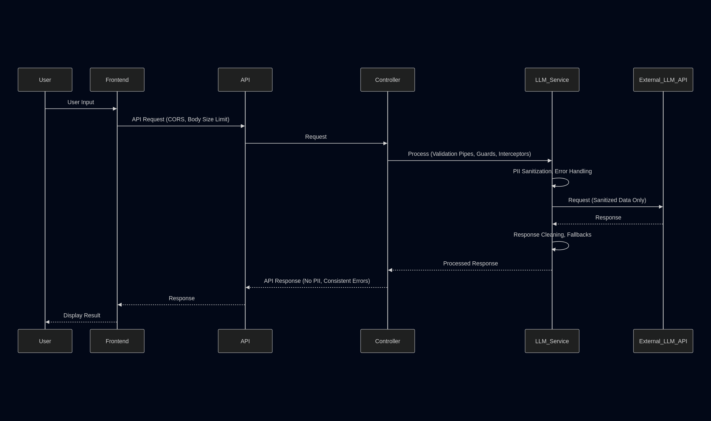

# LLM Service & Controller (Capstone Prototype)

This document describes the experimental Large Language Model (LLM) integration for the Bloom Capstone project.

> **Note:** This feature is a student prototype for learning and demonstration purposes only. It is not intended for production use.

> **Note:** As of now, the Income Assistant frontend and the backend LLM API (`/llm/chat`) are not yet fully integrated. The current assistant collects user input and submits it to a placeholder endpoint. Future updates will connect the assistant directly to the LLM API for real-time AI-powered responses.

---

## Overview

The LLM service and controller provide a simple API endpoint for interacting with a language model (LLM) to assist users with natural language questions during the application process.  
This integration is intended as a proof-of-concept and is not production-ready.

---

## Technologies Used

- **NestJS** (backend framework)
- **Axios** (for HTTP requests to the LLM API)
- **TypeScript**

---

## How It Works

1. **Frontend**: The user interacts with an assistant UI (e.g., on the income application page).
2. **API Call**: The frontend sends a POST request to `/llm/chat` with a message and optional conversation history.
3. **Controller**: `llm.controller.ts` receives the request and calls the LLM service.
4. **Service**: `llm.service.ts` sanitizes the input (removing PII), builds a prompt, and sends it to the LLM API.
5. **Response**: The LLM's response is cleaned and returned to the frontend for display.

---

## How to Use

### 1. Start the API Server

Make sure your backend API is running (typically on port 3100):

```sh
yarn dev
# or, if running from the api directory:
yarn start:dev
```

### 2. Make a Request to the LLM Endpoint

Send a POST request to `/llm/chat` with a JSON body containing your message and (optionally) conversation history.

**Example using `curl`:**

```sh
curl -X POST http://localhost:3100/llm/chat \
  -H "Content-Type: application/json" \
  -d '{
    "message": "How do I report my income?",
    "history": ["Hi!", "Hello, how can I help you?"]
  }'
```

**Expected Response:**

```json
{
  "response": "To report your income, please fill out the income section of the application form. If you have questions, let me know!"
}
```

### 3. Integrating in the Frontend

In your React/Next.js frontend, you can call the endpoint like this:

```js
const response = await fetch('/llm/chat', {
  method: 'POST',
  headers: { 'Content-Type': 'application/json' },
  body: JSON.stringify({
    message: 'How do I report my income?',
    history: ['Hi!', 'Hello, how can I help you?'],
  }),
});
const data = await response.json();
console.log(data.response);
```

---

## Data Security & PII

- All user input is sanitized in the service to redact common PII (e.g., SSNs, emails, phone numbers) before being sent to the LLM.
- This is a basic implementation; future improvements could include more advanced PII detection and logging.

---

## Development Status & Roadmap

- **Current:** Prototype/demo for capstone project
- **Future ideas:**
  - Improve PII detection and sanitization
  - Add more robust error handling and logging
  - Support for additional LLM models or providers
  - User consent and audit logging

---

## File Locations

- **Service:** `llm.service.ts`
- **Controller:** `../controllers/llm.controller.ts`
- **Module:** `../modules/llm.module.ts`

---

## Visuals



_Figure: End-to-end data flow and security layers for the LLM feature, from user input to LLM response._

---

## Acknowledgements

- Built as part of a student capstone project for learning and demonstration.
- Inspired by open source LLM and chatbot integrations.

---

## License

This code is for educational purposes only. See the main project license for details.
