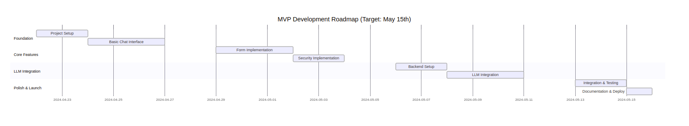
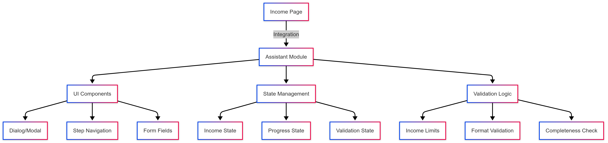
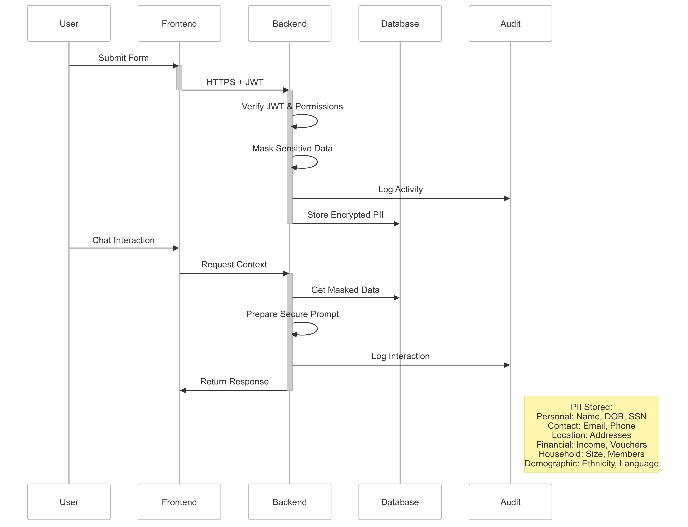

# Income Assistant Module

   

## Overview

An AI-powered guided assistant module for Bloom Housing's income verification process, enhancing user experience while maintaining strict security standards.

## Project Timeline

- **Week 1 (April 22-26)**: Foundation
  - Module Structure
  - Basic UI Components
  - Integration Setup
- **Week 2 (April 29-May 3)**: Core Features
  - Form Implementation
  - Validation Logic
  - State Management
- **Week 3 (May 6-10)**: LLM Integration
  - Backend Setup
  - Assistant Logic
  - Security Implementation
- **Week 4 (May 13-15)**: Polish & Launch
  - Testing & QA
  - Documentation
  - Final Integration

  ### MVP Road Map
  

## Architecture

### Component Architecture


### Data Sequence 


### Data Flow
```
┌─────────────┐     ┌─────────────┐     ┌─────────────┐
│   User      │     │   Income    │     │   Backend   │
│  Interface  │     │  Assistant  │     │    API      │
└──────┬──────┘     └──────┬──────┘     └──────┬──────┘
       │                   │                    │
       │  User Input       │  State Update      │  Data
       │─────────────────►│───────────────────►│  Validation
       │                   │                    │
       │  Response         │  API Call          │  Response
       │◄─────────────────│◄───────────────────│
       │                   │                    │
       │  Error Handling   │  Error State       │  Error
       │◄─────────────────│◄───────────────────│  Handling
```

## Project Tracking

Daily progress and project status are tracked in the `project_tracking` folder:
```
project_tracking/
├── screenshots/          # Daily project board screenshots
├── architecture/         # Architecture diagrams
└── documentation/        # Additional documentation
```

To add a new screenshot:
1. Take a screenshot of the project board
2. Save it in `project_tracking/screenshots/` with the format `YYYY-MM-DD.png`
3. Update the project status in the README if needed

## Features

- **Conversational Interface**: Natural language interaction for income verification
- **Step-by-Step Guidance**: Clear instructions for income documentation
- **Error Prevention**: Real-time validation and error checking
- **Accessibility**: WCAG 2.1 AA compliant
- **Responsive Design**: Works across all device sizes
- **State Management**: Persistent conversation state
- **Error Handling**: Graceful error recovery and user feedback

## Technical Stack

- **Frontend**: Next.js, TypeScript, React
- **Styling**: SCSS Modules, UI Seeds Design System
- **Testing**: Jest, React Testing Library
- **State Management**: React Context, Custom Hooks
- **API Integration**: RESTful endpoints
- **Accessibility**: ARIA attributes, keyboard navigation

## Project Structure

```
income/
├── IncomeAssistant.tsx
├── IncomeAssistant.types.ts
├── IncomeAssistant.module.scss
├── hooks/
│   ├── useAssistantState.ts
│   ├── useAssistantError.ts
│   └── useAssistantApi.ts
└── context/
    └── AssistantContext.tsx
```

## Integration

The Income Assistant is integrated into the income page at:
```
sites/public/src/pages/applications/financial/income.tsx
```

## Security Considerations

- No PII storage in assistant
- Form integration only
- Strict validation rules
- Accessibility focus
- Secure API endpoints
- Error boundary implementation
- Type-safe data handling

## Getting Started

### Prerequisites

- Node.js 16.x or later
- Yarn package manager
- Bloom Housing platform setup

### Installation

1. Ensure you're in the Bloom Housing repository root
2. Install dependencies:
   ```bash
   yarn install
   ```
3. Copy environment variables:
   ```bash
   cp .env.template .env
   ```

### Development

Run the development server:
```bash
yarn dev:all
```

### Testing

Run the test suite:
```bash
yarn test
```

## Development Guidelines

- Follow TypeScript strict mode
- Use Bloom UI components
- Maintain accessibility standards
- Include comprehensive tests
- Follow conventional commits
- Document all changes
- Include error boundaries
- Implement proper loading states

## UI Resources

- [UI Seeds Storybook](https://storybook-ui-seeds.netlify.app/?path=/story/tokens-introduction--page)
- [UI Seeds Design System](https://zeroheight.com/5e69dd4e1/p/938cb5-seeds-design-system)
- [WCAG 2.1 Guidelines](https://www.w3.org/TR/WCAG21/)

## API Resources

- [NestJS Documentation](https://docs.nestjs.com/)
- [Prisma Documentation](https://www.prisma.io/docs)
- [REST API Best Practices](https://www.moesif.com/blog/api-guide/api-design-best-practices/)

## React Resources

- [React Documentation](https://react.dev/)
- [React Context](https://react.dev/reference/react/useContext)
- [React Hooks](https://react.dev/reference/react)
- [React Testing Library](https://testing-library.com/docs/react-testing-library/intro/)
- [TypeScript React Cheatsheet](https://react-typescript-cheatsheet.netlify.app/)

## Contributing

1. Check current sprint in GitHub Projects
2. Create feature branch
3. Follow Bloom's coding standards
4. Submit PR with tests

Please read [CONTRIBUTING.md](../../../../../../CONTRIBUTING.md) for details on our code of conduct and the process for submitting pull requests.

## License

This project is licensed under the MIT License - see the [LICENSE.md](../../../../../../LICENSE.md) file for details. 